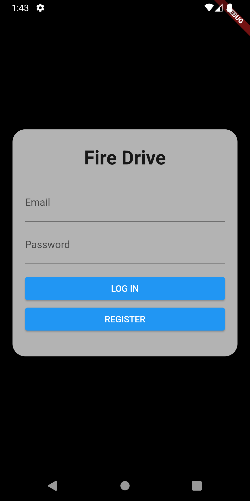
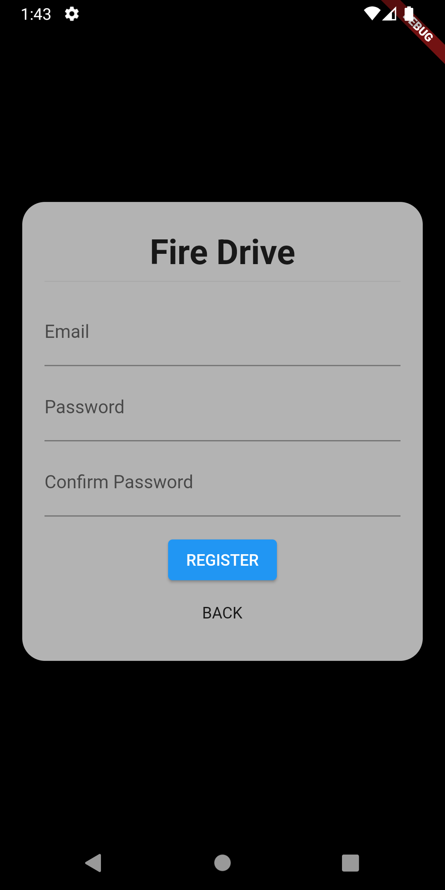
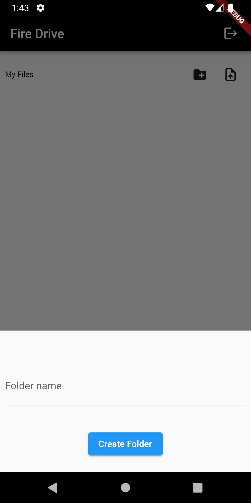
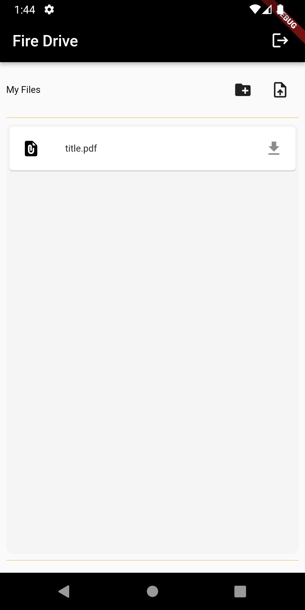
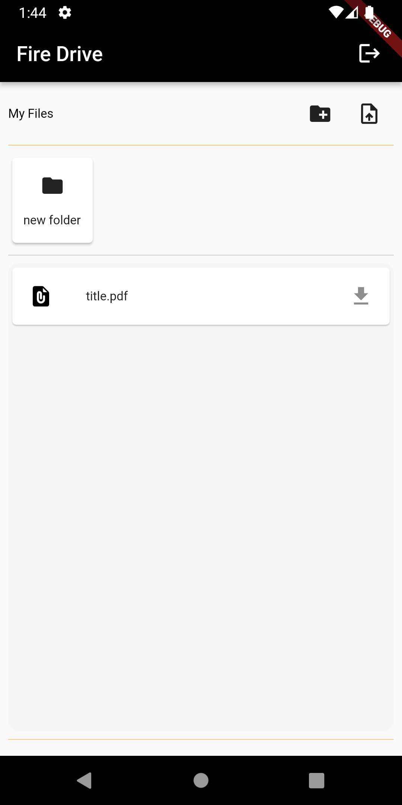

# FireDrive - storage app - Firebase Auth + Firebase storage + Mobx

A Flutter application for File Upload & Download using Firebase storage and Mobx state management with Firebase
Authentication.

# Features:
- State management using Mobx
- User Login and Signup
- Authentication using firebase_auth
- Storage using firebase_storage
- File Upload, Download & Delete options
- Folder creation and deletion
- Lottie Animations

# Screenshots

 
 

 
 

# --

